# Security Hardening LSM - Unified Architecture

## Complete System Architecture

```mermaid
%%{init: {'theme':'dark', 'themeVariables': { 'primaryColor':'#ff6600', 'primaryTextColor':'#ffffff', 'primaryBorderColor':'#ff8833', 'lineColor':'#5CE1E6', 'secondaryColor':'#11D9C5', 'tertiaryColor':'#096B6B', 'background':'#0a0a0a', 'mainBkg':'#1a1a1a', 'secondBkg':'#2a2a2a', 'tertiaryBkg':'#3a3a3a', 'nodeTextColor':'#ffffff', 'edgeLabelBackground':'#2a2a2a'}}}%%
graph TB
    %% Linux Kernel Layer
    subgraph KERNEL["<b>🐧 Linux Kernel Space</b>"]
        direction TB
        
        %% LSM Framework
        LSM_FRAMEWORK["<b>Linux Security Module Framework</b><br/>↓ Hook Points ↓"]
        
        %% Main Hardening Module
        subgraph HARDENING_CORE["<b>⚡ Security Hardening LSM Core</b>"]
            direction TB
            
            CORE_MOD["<b>🎯 hardening_lsm.c</b><br/>Main Module & Hook Registration<br/>Per-Task Security Context Management"]
            
            %% Security Features Grid
            subgraph FEATURES["<b>🛡️ Security Features</b>"]
                direction TB
                
                %% Row 1: Time & Behavior
                TEMPORAL["<b>⏰ Temporal Access</b><br/>temporal.c<br/>• Time-based rules<br/>• Schedule enforcement<br/>• Temporal anomalies"]
                BEHAVIOR["<b>🧠 Behavioral Analysis</b><br/>behavior.c<br/>• Anomaly detection<br/>• Pattern learning<br/>• Deviation scoring"]
                
                %% Row 2: Resources & Adaptive
                RESOURCES["<b>📊 Resource Fingerprinting</b><br/>resources.c<br/>• Baseline profiling<br/>• Usage monitoring<br/>• Deviation alerts"]
                ADAPTIVE["<b>🔄 Adaptive Security</b><br/>adaptive.c<br/>• Dynamic levels<br/>• Auto-escalation<br/>• De-escalation logic"]
                
                %% Row 3: Process & Container
                LINEAGE["<b>🌳 Process Lineage</b><br/>lineage.c<br/>• Parent tracking<br/>• Execution chains<br/>• Trust inheritance"]
                CONTAINER["<b>📦 Container Security</b><br/>container.c + docker_integration.c<br/>• Runtime detection<br/>• Escape prevention<br/>• Namespace isolation"]
                
                %% Row 4: Network & Memory
                NETWORK["<b>🌐 Network Profiling</b><br/>network.c<br/>• Connection tracking<br/>• Port monitoring<br/>• Traffic analysis"]
                MEMORY["<b>💾 Memory Analysis</b><br/>memory.c<br/>• Pattern detection<br/>• Injection prevention<br/>• Heap/Stack monitoring"]
                
                %% Row 5: Crypto & Quantum
                CRYPTO["<b>🔐 Cryptographic Integrity</b><br/>crypto.c<br/>• Hash verification<br/>• Signature checking<br/>• Key management"]
                QUANTUM["<b>⚛️ Quantum-Resistant</b><br/>quantum.c<br/>• CRYSTALS-Kyber<br/>• CRYSTALS-Dilithium<br/>• Hybrid approach"]
                
                %% Row 6: Utilities
                ENTROPY["<b>🎲 Entropy Randomization</b><br/>entropy.c<br/>• ASLR enhancement<br/>• Stack randomization<br/>• Timing jitter"]
                SYSCALL["<b>🚫 Syscall Filtering</b><br/>syscall_filter.c<br/>• Whitelist/Blacklist<br/>• Per-process rules<br/>• Seccomp integration"]
                
                %% Row 7: Management
                PROFILES["<b>📋 Security Profiles</b><br/>profiles.c<br/>• Policy templates<br/>• Role-based security<br/>• Custom profiles"]
                STATS["<b>📈 Statistics Engine</b><br/>stats.c<br/>• Performance metrics<br/>• Security events<br/>• Audit logging"]
            end
            
            %% Interfaces
            SECURITYFS["<b>📁 SecurityFS Interface</b><br/>hardening_fs.c<br/>User-kernel communication"]
        end
        
        %% Kernel Subsystems
        subgraph KERNEL_SUBSYS["<b>🔧 Kernel Subsystems</b>"]
            direction LR
            FILE_OPS["<b>📄 File</b><br/>Operations"]
            PROC_MGMT["<b>⚙️ Process</b><br/>Management"]
            NET_STACK["<b>🌐 Network</b><br/>Stack"]
            MEM_MGMT["<b>💾 Memory</b><br/>Management"]
            CAPS_SYS["<b>🔑 Capability</b><br/>System"]
        end
        
        %% LSM Hooks Detail
        subgraph LSM_HOOKS["<b>🪝 LSM Hook Points</b>"]
            direction LR
            HOOK_FILE["file_open<br/>file_permission<br/>file_mprotect"]
            HOOK_PROC["bprm_creds_for_exec<br/>ptrace_access_check<br/>task_prctl"]
            HOOK_NET["socket_create<br/>socket_connect<br/>socket_sendmsg"]
            HOOK_CRED["cred_alloc_blank<br/>cred_free<br/>capable"]
            HOOK_MEM["mmap_addr<br/>sb_mount"]
        end
    end
    
    %% Userspace Layer
    subgraph USERSPACE["<b>👤 User Space</b>"]
        direction TB
        
        %% Management Tools
        subgraph TOOLS["<b>🔨 Management Tools</b>"]
            direction LR
            HARDENING_CTL["<b>hardening-ctl</b><br/>Main control utility"]
            QUANTUM_CTL["<b>quantum-ctl</b><br/>Crypto management"]
            PROFILE_MGR["<b>profile-manager</b><br/>Policy editor"]
        end
        
        %% Filesystem Interfaces
        subgraph INTERFACES["<b>📂 Filesystem Interfaces</b>"]
            direction LR
            SECFS_PATH["<b>/sys/kernel/security/hardening/</b><br/>• status • stats • policy • quantum"]
            PROC_PATH["<b>/proc/sys/kernel/hardening/</b><br/>• enabled • enforce_mode • debug"]
        end
    end
    
    %% Quantum Crypto Detail
    subgraph QUANTUM_DETAIL["<b>⚛️ Quantum Cryptography System</b>"]
        direction TB
        
        subgraph Q_CONTEXT["<b>Quantum Context</b>"]
            Q_IDENTITY["<b>🔑 Identity Keys</b><br/>Long-term (30 days)"]
            Q_EPHEMERAL["<b>⏱️ Ephemeral Keys</b><br/>Short-term (24 hours)"]
            Q_ROTATION["<b>🔄 Key Rotation</b><br/>Automatic renewal"]
        end
        
        subgraph Q_ALGO["<b>Algorithms</b>"]
            direction LR
            Q_KEM["<b>Key Encapsulation</b><br/>• Kyber768 (Level 3)<br/>• Kyber1024 (Level 5)"]
            Q_SIG["<b>Digital Signatures</b><br/>• Dilithium3 (Level 3)<br/>• Dilithium5 (Level 5)"]
        end
        
        subgraph Q_HYBRID["<b>Hybrid Security</b>"]
            Q_CLASSICAL["<b>Classical</b><br/>AES-256<br/>SHA3-256"]
            Q_POSTQ["<b>Post-Quantum</b><br/>Lattice-based<br/>NIST approved"]
            Q_COMBINED["<b>Combined Keys</b><br/>Defense in depth"]
        end
    end
    
    %% Security States
    subgraph SEC_STATES["<b>🚦 Security Level States</b>"]
        direction LR
        
        STATE_NORMAL["<b>🟢 NORMAL</b><br/>• Full functionality<br/>• Learning mode<br/>• Minimal overhead"]
        STATE_ELEVATED["<b>🟡 ELEVATED</b><br/>• Minor restrictions<br/>• Enhanced monitoring<br/>• Behavioral analysis"]
        STATE_HIGH["<b>🟠 HIGH</b><br/>• Major restrictions<br/>• Quantum auth required<br/>• Container isolation"]
        STATE_CRITICAL["<b>🔴 CRITICAL</b><br/>• Maximum security<br/>• Emergency mode<br/>• Full audit logging"]
    end
    
    %% Container Security Detail
    subgraph CONTAINER_SEC["<b>📦 Container Security System</b>"]
        direction TB
        
        DETECT["<b>Detection</b><br/>• Cgroups check<br/>• Namespace analysis<br/>• Runtime identification"]
        POLICIES["<b>Policies</b><br/>• Capability dropping<br/>• Mount restrictions<br/>• Network isolation"]
        ENFORCE["<b>Enforcement</b><br/>• Escape prevention<br/>• Resource limits<br/>• Syscall filtering"]
    end
    
    %% Performance Optimization
    subgraph PERF_OPT["<b>⚡ Performance Optimization</b>"]
        direction LR
        
        RATE_LIMIT["<b>Rate Limiting</b><br/>DoS protection"]
        BATCH["<b>Batching</b><br/>Syscall grouping"]
        CACHE["<b>Caching</b><br/>Decision memory"]
        FAST_PATH["<b>Fast Paths</b><br/>• Skip kernel threads<br/>• Recent check cache<br/>• Low security bypass"]
    end
    
    %% Main Connections
    LSM_FRAMEWORK ==> CORE_MOD
    
    %% Core to Features
    CORE_MOD ==> TEMPORAL
    CORE_MOD ==> BEHAVIOR
    CORE_MOD ==> RESOURCES
    CORE_MOD ==> ADAPTIVE
    CORE_MOD ==> LINEAGE
    CORE_MOD ==> CONTAINER
    CORE_MOD ==> NETWORK
    CORE_MOD ==> MEMORY
    CORE_MOD ==> CRYPTO
    CORE_MOD ==> QUANTUM
    CORE_MOD ==> ENTROPY
    CORE_MOD ==> SYSCALL
    CORE_MOD ==> PROFILES
    CORE_MOD ==> STATS
    
    %% Interface connections
    CORE_MOD <==> SECURITYFS
    SECURITYFS <==> SECFS_PATH
    CORE_MOD <==> PROC_PATH
    
    %% Kernel subsystem connections
    FILE_OPS ==> LSM_FRAMEWORK
    PROC_MGMT ==> LSM_FRAMEWORK
    NET_STACK ==> LSM_FRAMEWORK
    MEM_MGMT ==> LSM_FRAMEWORK
    CAPS_SYS ==> LSM_FRAMEWORK
    
    %% Hook connections
    LSM_HOOKS ==> LSM_FRAMEWORK
    
    %% Tool connections
    TOOLS ==> INTERFACES
    
    %% Quantum detail connections
    QUANTUM -.-> QUANTUM_DETAIL
    Q_CLASSICAL --> Q_COMBINED
    Q_POSTQ --> Q_COMBINED
    
    %% State transitions
    STATE_NORMAL ==>|"Anomaly"| STATE_ELEVATED
    STATE_ELEVATED ==>|"Threat"| STATE_HIGH
    STATE_HIGH ==>|"Critical"| STATE_CRITICAL
    STATE_CRITICAL ==>|"Recovery"| STATE_HIGH
    STATE_HIGH ==>|"Clear"| STATE_ELEVATED
    STATE_ELEVATED ==>|"Timeout"| STATE_NORMAL
    
    %% Container connections
    CONTAINER -.-> CONTAINER_SEC
    
    %% Performance connections
    CORE_MOD -.-> PERF_OPT
    
    %% Security state influence
    ADAPTIVE -.-> SEC_STATES
    
    %% Per-task context
    subgraph TASK_CTX["<b>📌 Per-Task Security Context</b>"]
        direction LR
        CTX_TIME["Time Rules"]
        CTX_BEHAV["Behavior Profile"]
        CTX_RES["Resource Baseline"]
        CTX_LINE["Process Lineage"]
        CTX_CONT["Container Info"]
        CTX_NET["Network Profile"]
        CTX_MEM["Memory Profile"]
        CTX_CRYPTO["Crypto Context"]
        CTX_QUANTUM["Quantum Keys"]
        CTX_LEVEL["Security Level"]
    end
    
    CORE_MOD -.-> TASK_CTX
    
    %% Data flow highlight
    classDef coreClass fill:#ff6600,stroke:#ff8833,stroke-width:3px,color:#ffffff
    classDef featureClass fill:#11D9C5,stroke:#5CE1E6,stroke-width:2px,color:#ffffff
    classDef interfaceClass fill:#096B6B,stroke:#0a8a8a,stroke-width:2px,color:#ffffff
    classDef stateClass fill:#FFD700,stroke:#FFA500,stroke-width:2px,color:#000000
    classDef quantumClass fill:#9D4EDD,stroke:#C77DFF,stroke-width:2px,color:#ffffff
    
    class CORE_MOD coreClass
    class TEMPORAL,BEHAVIOR,RESOURCES,ADAPTIVE,LINEAGE,CONTAINER,NETWORK,MEMORY,CRYPTO,QUANTUM,ENTROPY,SYSCALL,PROFILES,STATS featureClass
    class SECURITYFS,SECFS_PATH,PROC_PATH interfaceClass
    class STATE_NORMAL,STATE_ELEVATED,STATE_HIGH,STATE_CRITICAL stateClass
    class QUANTUM_DETAIL,Q_CONTEXT,Q_ALGO,Q_HYBRID quantumClass
```



## Key Features & Benefits

| Component | Purpose | Security Benefit |
|-----------|---------|------------------|
| **Temporal Access Control** | Time-based access rules | Prevents off-hours attacks |
| **Behavioral Analysis** | ML-based anomaly detection | Catches zero-day exploits |
| **Resource Fingerprinting** | Baseline deviation monitoring | Detects resource abuse |
| **Adaptive Security** | Dynamic threat response | Auto-adjusts to threat level |
| **Process Lineage** | Execution chain tracking | Prevents privilege escalation |
| **Container Security** | Runtime isolation | Container escape prevention |
| **Network Profiling** | Connection monitoring | Detects lateral movement |
| **Memory Analysis** | Injection detection | Stops memory exploits |
| **Quantum-Resistant Crypto** | Post-quantum algorithms | Future-proof security |
| **Entropy Randomization** | ASLR enhancement | Harder exploit development |

## Implementation Flow

1. **System Call Interception** → LSM Framework catches all security-relevant operations
2. **Context Retrieval** → Per-task security context loaded with all profiles
3. **Multi-Layer Checks** → Each security module performs its specific analysis
4. **Decision Aggregation** → Combined results determine allow/deny
5. **Adaptive Response** → Security level adjusts based on threat detection
6. **Audit & Statistics** → All events logged for analysis and learning

## Quick Start Commands

```bash
# Enable the module
echo 1 > /proc/sys/kernel/hardening/enabled

# Set enforcement mode
echo "enforce" > /sys/kernel/security/hardening/policy

# Check current status
cat /sys/kernel/security/hardening/status

# View statistics
cat /sys/kernel/security/hardening/stats

# Rotate quantum keys
echo "rotate" > /sys/kernel/security/hardening/quantum
```

This unified architecture diagram provides a complete overview of the Security Hardening LSM, showing how all components work together to provide comprehensive, adaptive, and quantum-resistant security for Linux systems.